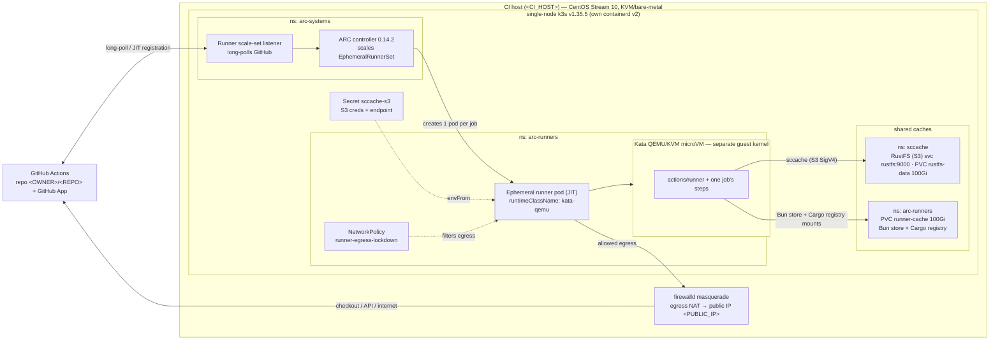

# Self-hosted Kata CI

This is a self-hosted GitHub Actions setup where **every CI job on the self-hosted `omp-kata` label runs inside its own throwaway Kata Containers QEMU/KVM microVM**. A single bare-metal Linux host runs a one-node [k3s](https://k3s.io) cluster; [actions-runner-controller (ARC)](https://github.com/actions/actions-runner-controller) watches GitHub for queued jobs and, for each one, creates a just-in-time ephemeral runner pod that boots a fresh microVM (its own guest kernel, isolated from the host), runs exactly one job, and is then destroyed. Pull requests deliberately run on GitHub-hosted runners instead, so the self-hosted fleet only serves trusted `push`/main + release builds and untrusted PR code never reaches the shared caches (see [04-arc-and-caching.md](04-arc-and-caching.md)). Runners share an in-cluster **RustFS** (S3-compatible) object store for `sccache`, plus a namespace-local PVC mounted as the Bun package store and Cargo registry cache. Public internet egress goes through host NAT under a restrictive NetworkPolicy. The result is hardware-isolated, scale-to-zero CI on hardware you control.

These docs are written as a **from-scratch setup guide**: read this overview first, then follow the numbered guides in order to reproduce the system on your own host.

## Architecture

Key properties baked into this design:

- **One job = one VM.** Runner pods are ephemeral and JIT-registered; there is no VM templating or pooling, so a job never inherits state from a previous job.
- **Scale-to-zero.** `minRunners: 0` / `maxRunners: 10` — when no jobs are queued, zero runner pods (and zero microVMs) exist.
- **Host-kernel isolation.** Jobs see the microVM's guest kernel, not the host kernel, so a kernel exploit in a job does not reach the host.
- **No external registry.** The runner image is built on the host and imported straight into k3s' containerd.
- **Shared, in-cluster cache.** `sccache` targets RustFS over the cluster network; Bun's package store and Cargo's registry cache are mounted from the runner cache PVC. Cache traffic stays on the host.

## End-to-end job lifecycle

1. A workflow job targeting the self-hosted label (`runs-on:`) is **queued** on GitHub.
2. The **scale-set listener** in `arc-systems` is long-polling the GitHub Actions service and receives the job-assignment message.
3. The listener signals demand to the **ARC controller**, which scales the **EphemeralRunnerSet** up by one.
4. The controller creates a single **JIT-registered ephemeral runner pod** in `arc-runners`, with `runtimeClassName: kata-qemu` and the `sccache-s3` secret injected via `envFrom`.
5. containerd hands the pod to the Kata shim, which **boots a fresh QEMU/KVM microVM** (own guest kernel; the container rootfs is shared in over virtio-fs). No templating — every job gets a clean VM.
6. The runner agent inside the microVM **registers just-in-time and picks up exactly one job**. Steps run isolated from the host, using RustFS over S3 for `sccache`, mounted PVC paths for Bun/Cargo package caches, and NAT egress for the public internet, all constrained by the `runner-egress-lockdown` NetworkPolicy.
7. The job finishes; the ephemeral runner **deregisters and the pod (and its microVM) is destroyed** — never reused.
8. When no jobs remain queued, the EphemeralRunnerSet **scales back to zero**, leaving no idle runners or VMs.

## Component map (bill of materials)

| Component | What it is | Version | Documented in |
| --- | --- | --- | --- |
| Host + k3s cluster | Bare-metal CentOS Stream 10 node running single-node k3s (own containerd v2, Flannel CNI; Traefik + servicelb disabled so host nginx keeps :80/:443); firewalld provides NAT egress | k3s `v1.35.5+k3s1` | [01-host-and-cluster.md](01-host-and-cluster.md) |
| Kata Containers runtime | QEMU/KVM microVM runtime: containerd drop-in registering `kata-qemu` + the `kata-qemu` RuntimeClass | Kata `3.31.0` | [02-kata-runtime.md](02-kata-runtime.md) |
| Preloaded runner image | Custom `actions/runner` image (build toolchain, Bun, Rust nightly + cross targets, native-build deps) built on the host and imported into k3s containerd — no registry | local dated tag | [03-runner-image.md](03-runner-image.md) |
| ARC (runner scale set) | actions-runner-controller, `gha-runner-scale-set` flavor: controller in `arc-systems`, one scale set + listener, GitHub App auth | ARC `0.14.2` | [04-arc-and-caching.md](04-arc-and-caching.md) |
| Shared caches | RustFS S3 (`svc rustfs:9000`, 100Gi PVC) backs `sccache`; `arc-runners/runner-cache` (100Gi PVC) mounts Bun's package store and Cargo's registry cache into runner pods; the `sccache-s3` secret and egress NetworkPolicy wire access | in-cluster services/storage | [04-arc-and-caching.md](04-arc-and-caching.md) |

## Prerequisites

Before starting, you need:

- **A Linux host with hardware virtualization.** Intel VT-x or AMD-V enabled, KVM available (`/dev/kvm` present and accessible). Bare metal is simplest; on a VM you need working nested virtualization. The reference host is 32 vCPU / 125 GiB RAM — size to roughly `maxRunners × per-job resources` plus cluster overhead.
- **Root (or full sudo)** on that host: you will install k3s, Kata, kernel modules, firewall rules, and a container image.
- **A public-ish egress path.** The host must reach GitHub; runner microVMs NAT out through the host's public IP. No inbound ports are required for the runners (the listener uses outbound long-poll).
- **A GitHub repository** to attach runners to, and a **GitHub App** (recommended) or PAT installed on it with permissions to manage self-hosted runners. You will record the App ID, installation ID, and private key as a Kubernetes secret.
- **CLI tooling on the host:** `kubectl` and `helm` (k3s bundles a kubectl), plus Docker/buildkit for building the runner image (see [03-runner-image.md](03-runner-image.md)).

## Redaction & placeholders

The configs in this doc set are copied verbatim from the live host and then redacted. Wherever you see one of these tokens, substitute your own value:

| Placeholder | Substitute with |
| --- | --- |
| `<CI_HOST>` | Your CI host's hostname / SSH target |
| `<PUBLIC_IP>` | The host's public IPv4 address |
| `<TAILNET_IP>` | Your Tailscale/tailnet admin IP(s) (the generic CGNAT range `100.64.0.0/10` is kept as-is) |
| `<OWNER>/<REPO>` | Your GitHub repository owner and name |
| `<GITHUB_APP_ID>` | Your GitHub App ID |
| `<GITHUB_APP_INSTALLATION_ID>` | Your GitHub App installation ID |
| `<GITHUB_APP_PRIVATE_KEY>` | Your GitHub App private key (PEM) |
| `<S3_ACCESS_KEY>` | RustFS/S3 access key ID |
| `<S3_SECRET_KEY>` | RustFS/S3 secret access key |
| `<PLACEHOLDER>` | Any other password/key/token (named in context where it appears) |

Secret **values** never appear in these docs — only key names and placeholders. The following are intentionally **kept as-is** because they are not sensitive and are needed to follow along: the pod CIDR `10.42.0.0/16`, the service CIDR `10.43.0.0/16`, the CoreDNS service IP `10.43.0.10`, the bucket name `sccache`, in-cluster service DNS names and ports, and all version numbers.

## Recommended setup order

Work through the numbered guides in order — each builds on the previous:

1. **[01-host-and-cluster.md](01-host-and-cluster.md)** — Host prep (KVM, firewall/NAT) and the single-node k3s install, networking, and CNI.
2. **[02-kata-runtime.md](02-kata-runtime.md)** — Install Kata Containers, wire it into k3s' containerd, and register the `kata-qemu` RuntimeClass.
3. **[03-runner-image.md](03-runner-image.md)** — Build the preloaded runner image and import it into k3s containerd.
4. **[04-arc-and-caching.md](04-arc-and-caching.md)** — Install ARC and the runner scale set, deploy RustFS for `sccache`, add the runner cache PVC for Bun/Cargo, wire up the `sccache-s3` secret, and apply the egress NetworkPolicy.
